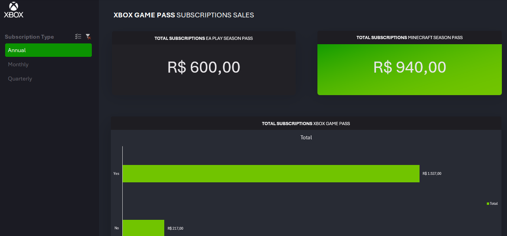

# Xbox Sales Hub

## Descrição

O **Xbox Sales Hub** é uma planilha que centraliza dados, análises e visualizações sobre as vendas de assinaturas do Xbox Game Pass. A ferramenta tem como objetivo fornecer uma visão clara do desempenho das vendas, dos tipos de assinaturas e dos complementos adquiridos, facilitando a tomada de decisão.

## Estrutura da Planilha

O arquivo contém as seguintes abas:

### 1. **Assets**

* Contém a paleta de cores utilizada no dashboard e elementos visuais como menus, background e logotipo.
* Serve para padronização estética da apresentação dos dados.

### 2. **Bases**

* É a base de dados principal.
* Informações sobre os assinantes, incluindo:

  * **Subscriber ID** e **Nome**
  * **Plano contratado** (Ultimate, Standard, Core)
  * **Data de início do plano**
  * **Renovação automática** (Yes/No)
  * **Preço da assinatura**
  * Informações sobre complementos:

    * **EA Play Season Pass** e seu preço
    * **Minecraft Season Pass** e seu preço
  * **Valor de cupom de desconto**
  * **Valor total pago pelo cliente**

### 3. **Cálculos**

* Espaço dedicado às perguntas de negócio.
* Formulações como:

  * Faturamento total das vendas de planos
  * Faturamento com complementos
  * Análise de impacto de cupons e renovações

### 4. **Dashboard**

* Área visual do projeto.
* Contém gráficos, indicadores e representações visuais das análises realizadas na aba "Cálculos".

## Objetivo

A planilha tem como finalidade permitir o acompanhamento das vendas de assinaturas e complementos, além de responder perguntas-chave do negócio, como:

* Qual é o plano mais vendido?
* Qual o impacto da renovação automática nas receitas?
* Quanto foi gerado com a venda dos passes adicionais (EA Play e Minecraft)?

## Como Utilizar

1. Atualize os dados de vendas na aba **Bases**.
2. Verifique e ajuste os cálculos na aba **Cálculos**, se necessário.
3. A aba **Dashboard** se atualizará automaticamente, refletindo as alterações feitas nos dados.
